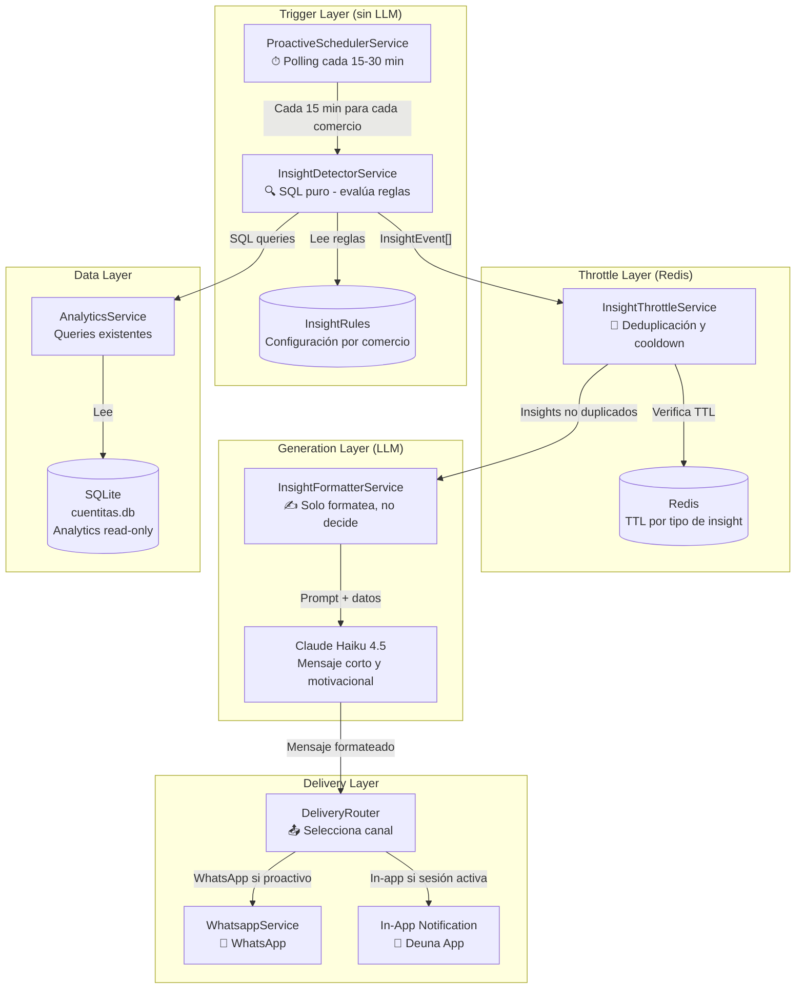
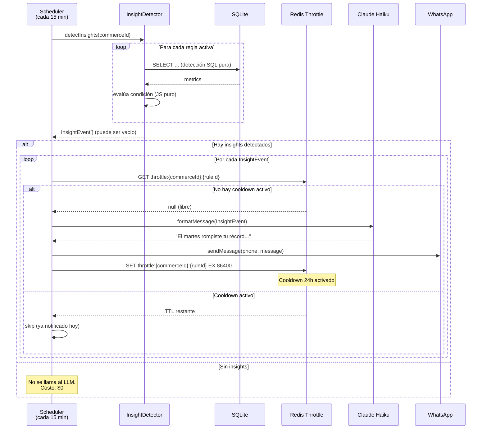
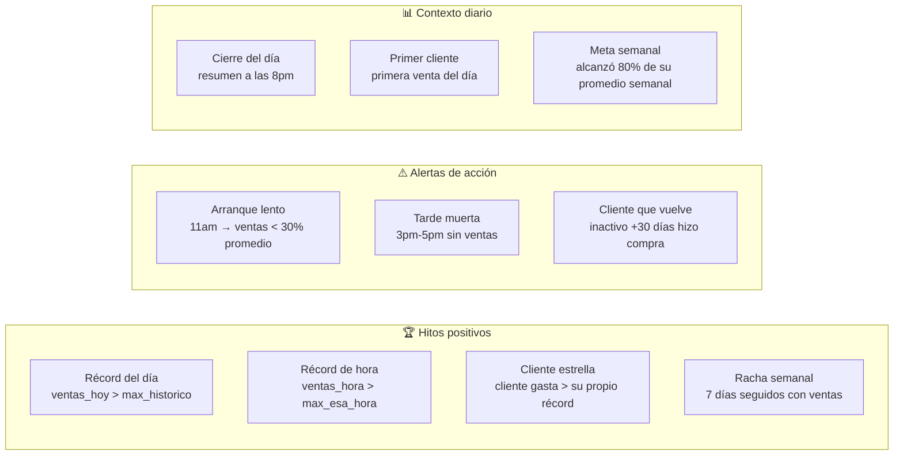
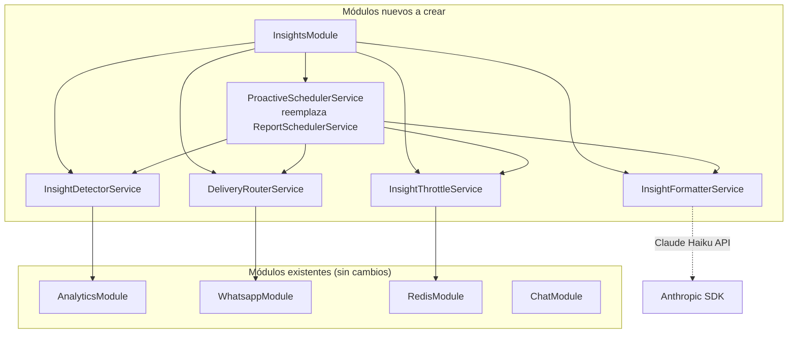
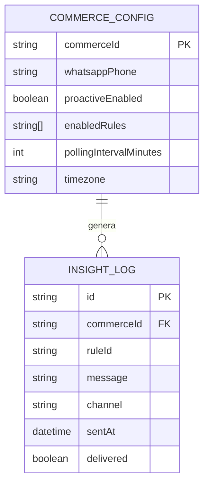
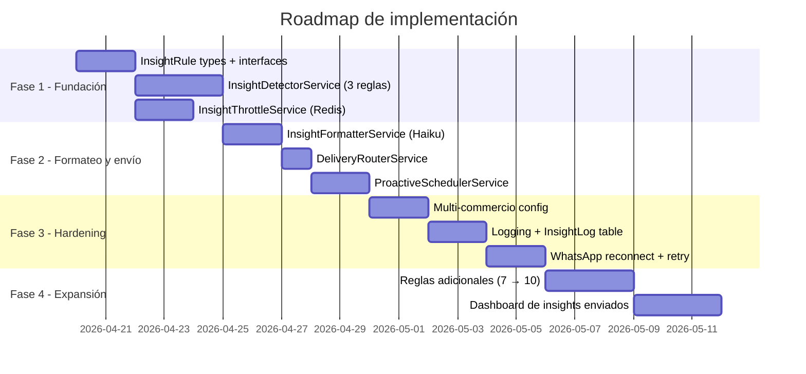

# Propuesta: Motor de Insights Proactivos vía WhatsApp

**Proyecto:** Cuentitas — Deuna Negocios  
**Fecha:** Abril 2026  
**Autor:** Análisis de arquitectura senior  

---

## 1. Estado actual del sistema

### 1.1 WhatsApp

Funciona con `whatsapp-web.js` (automatización de browser vía Puppeteer). Actualmente **sí puede enviar mensajes**, pero con estas limitaciones:

| Aspecto | Estado actual |
|---|---|
| Envío de mensajes | ✅ Funcional |
| Autenticación | QR manual por consola (un solo escaneo, persiste en disco) |
| Proactividad | Solo un cron a las 6 PM, hardcoded para `commerceId = "1"` |
| Resiliencia | Sin reconexión automática, sin retry, sin circuit breaker |
| Multi-comercio | ❌ No implementado |

### 1.2 Agente conversacional

Usa LangGraph ReAct con `gpt-4o`. El agente es reactivo: solo actúa cuando el usuario escribe. Tiene 9 herramientas analíticas sobre SQLite. El scheduler actual llama a `generateInsightReport()` que usa el LLM para formatear el resumen diario — pero **el trigger es solo temporal (6 PM) y no analiza condiciones de negocio**.

### 1.3 El problema central

```
Situación actual:
  → Timer dispara a las 6 PM
  → Se llama siempre, sin importar qué pasó en el día
  → Mensaje genérico para un solo comercio
  → Costo LLM innecesario aunque no haya nada notable que reportar

Lo que queremos:
  → El sistema DETECTA algo relevante (récord, anomalía, hito)
  → Solo entonces formatea y envía
  → Mensaje personalizado, oportuno, corto
  → Funciona para múltiples comercios
```

---

## 2. Principios de diseño

### 2.1 Separación crítica: Detección vs. Formateo

El error más común (y costoso) en este tipo de sistemas es usar LLM para **detectar** si algo es notable. Eso es un antipatrón:

```
❌ Antipatrón:
   Polling cada 15 min → LLM analiza datos → decide si hay insight → formatea → envía
   Costo: N comercios × frecuencia × $0.01/llamada LLM = caro y lento

✅ Patrón correcto:
   Polling cada 15 min → SQL puro detecta triggers → si hay insight → LLM formatea → envía
   Costo LLM: solo cuando hay algo real que decir
```

La detección es lógica determinista. El LLM solo entra para escribir el mensaje en lenguaje natural.

### 2.2 Anti-spam: Throttling por regla

Un comercio no debe recibir más de 2-3 mensajes WhatsApp por día. Cada tipo de insight tiene un cooldown en Redis.

### 2.3 Costo real del sistema

Con el enfoque correcto:
- Checks de detección: **$0** (puro SQL)
- Formatos LLM por insight: ~**$0.001** con Haiku (128K tokens, muy pequeño)
- Un comercio activo genera ~2-4 insights/día
- **Costo estimado por comercio/mes: ~$0.10 - $0.30**

---

## 3. Arquitectura propuesta

### 3.1 Visión general



### 3.2 Flujo detallado de un insight



---

## 4. Catálogo de insights

Cada regla tiene: **condición SQL**, **cooldown**, **prioridad** y **ejemplo de mensaje**.



### 4.1 Definición detallada de reglas

```typescript
// Ejemplo de cómo se vería InsightRule[]

interface InsightRule {
  id: string;
  name: string;
  cooldownHours: number;    // Redis TTL
  priority: 'high' | 'medium' | 'low';
  detect: (commerceId: string, analytics: AnalyticsService) => Promise<InsightEvent | null>;
}

// Regla 1: Récord del día (antes del cierre)
{
  id: 'daily_record',
  cooldownHours: 24,
  detect: async (commerceId, analytics) => {
    const today = await analytics.getDailySummary(commerceId, today);
    const best = await analytics.getBestDay(commerceId);
    
    // Solo aplica si es antes de las 6pm (aún puede seguir subiendo)
    const hour = new Date().getHours();
    if (hour >= 18) return null;
    
    if (today.totalSales > best.totalSales) {
      return {
        ruleId: 'daily_record',
        data: { todaySales: today.totalSales, bestSales: best.totalSales, currentHour: hour },
        // El LLM formateará esto en lenguaje natural
      };
    }
    return null;
  }
}

// Regla 2: Arranque lento
{
  id: 'slow_start',
  cooldownHours: 24,
  detect: async (commerceId, analytics) => {
    const hour = new Date().getHours();
    if (hour !== 11) return null;  // Solo evalúa a las 11am
    
    const todayMorning = await analytics.getDailySummary(commerceId, today);
    const weekTrend = await analytics.getWeeklyTrend(commerceId, 7);
    const avgMorning = weekTrend.average; // promedio mañanas previas
    
    if (todayMorning.totalSales < avgMorning * 0.3) {
      return { ruleId: 'slow_start', data: { current: todayMorning.totalSales, avg: avgMorning } };
    }
    return null;
  }
}
```

---

## 5. Estructura de módulos NestJS



### 5.1 Archivos a crear

```
backend/src/insights/
├── insights.module.ts
├── insight-detector.service.ts      # SQL puro, sin LLM
├── insight-throttle.service.ts      # Redis deduplication
├── insight-formatter.service.ts     # LLM formatting (Claude Haiku)
├── delivery-router.service.ts       # Canal selection
├── proactive-scheduler.service.ts   # Orquestador principal
├── rules/
│   ├── daily-record.rule.ts
│   ├── slow-start.rule.ts
│   ├── returning-client.rule.ts
│   ├── day-summary.rule.ts
│   └── index.ts                     # Export InsightRules[]
└── types/
    ├── insight-event.ts
    └── insight-rule.ts
```

---

## 6. Configuración multi-comercio

El sistema actual tiene `commerceId` hardcoded a `"1"`. El diseño nuevo debe soportar múltiples comercios con distintas configuraciones.



**Para el MVP:** Esta config puede vivir como variable de entorno o en un JSON simple. No requiere nueva tabla Prisma de inmediato.

```typescript
// Ejemplo config MVP (puede ser un JSON o env var)
const COMMERCE_CONFIGS = [
  {
    commerceId: '1',
    name: 'Tienda de Carmita',
    whatsappPhone: process.env.CARMITA_PHONE,
    proactiveEnabled: true,
    enabledRules: ['daily_record', 'slow_start', 'day_summary'],
    timezone: 'America/Guayaquil',
  }
];
```

---

## 7. Prompt de formateo (InsightFormatterService)

El LLM recibe datos crudos y genera el mensaje. El sistema decide si hay algo que decir; el LLM solo elige las palabras.

```
SYSTEM:
Eres el asistente financiero de Cuentitas. Escribe mensajes de WhatsApp
muy cortos (máximo 3 líneas) para dueños de negocios en Ecuador.
Reglas:
- Tuteo siempre ("¡Rompiste!", no "¡Usted rompió!")
- Dólares como "$94", nunca "94 USD"
- Emojis moderados (1-2 por mensaje, no más)
- Nada de jerga financiera (ni KPI, ni ROI, ni métricas)
- Positivo y motivacional, pero honesto
- Si es alerta, sugiere UNA acción concreta

USER:
Tipo de insight: daily_record
Datos: {
  "todaySales": 187.50,
  "bestHistoricSales": 183.00,
  "bestHistoricDate": "2025-11-15",
  "currentHour": 15,
  "topClient": "María López"
}

ASSISTANT:
🏆 ¡Récord del mes! Ya llevas $187 y aún son las 3 PM.
María López fue tu cliente estrella hoy.
¡A seguir así!
```

---

## 8. Plan de implementación



### 8.1 Fase 1: Implementación mínima (1 semana)

**Meta:** Sistema detecta récord del día y envía mensajes reales.

1. Crear `InsightDetectorService` con 3 reglas: `daily_record`, `slow_start`, `day_summary`
2. Usar Redis existente (ya está en el proyecto) para throttle con TTL
3. Refactorizar `generateInsightReport()` en `InsightFormatterService` propio
4. Migrar `@Cron(6PM)` de `ReportSchedulerService` a `ProactiveSchedulerService` con polling configurable
5. Agregar `COMMERCE_CONFIGS` array como constante (sin DB por ahora)

**No requiere cambios en:** `WhatsappService`, `AnalyticsService`, `ChatModule`

---

## 9. Respuesta a la pregunta de costo

> "¿No sería muy costoso que el agente esté analizando todo el tiempo?"

**La clave es que el agente NO analiza.** El SQL analiza. El LLM solo escribe.

```
Escenario real para 10 comercios:
────────────────────────────────────────────────
Polling cada 20 min → 72 checks/día × 10 comercios = 720 SQL queries/día
Costo SQL: $0.00 (SQLite local)

Insights que disparan (estimado 2-4/día/comercio):
  → 3 comercios activos generan 9 insights/día
  → Claude Haiku: ~200 tokens por mensaje
  → $0.0008 por insight

Costo LLM total/día: ~$0.007
Costo LLM total/mes: ~$0.21
────────────────────────────────────────────────
```

**En producción con datos reales** (Postgres + event sourcing):
- Se elimina el polling
- Cada transacción dispara un evento
- El detector evalúa las reglas solo cuando hay movimiento real
- Costo LLM igual, pero latencia de insight pasa de ~20 min a segundos

---

## 10. Comparación: enfoque actual vs. propuesto

| Aspecto | Actual | Propuesto |
|---|---|---|
| Trigger | Timer fijo 6 PM | Event-driven via polling inteligente |
| Comercios | 1 (hardcoded) | N comercios configurables |
| Detección | LLM decide si hay algo notable | SQL determina, LLM solo formatea |
| Costo por día | Fijo (siempre llama LLM) | Variable (solo si hay insight real) |
| Tipos de insight | 1 (resumen diario) | 7+ (récords, alertas, hitos, contexto) |
| Cooldown | Ninguno (puede repetir mensajes) | Redis TTL por regla/comercio |
| Oportunidad | Solo cierre de día | Cualquier momento del día |
| WhatsApp reliability | Sin retry | Retry + circuit breaker |
| Logging | Console.log | InsightLog table en Prisma |

---

## 11. Decisión sobre WhatsApp Web vs. API oficial

`whatsapp-web.js` es bueno para MVP pero tiene riesgos:

| | whatsapp-web.js (actual) | WhatsApp Business API (Meta) |
|---|---|---|
| Costo | Gratis | $0.05-$0.15 por conversación |
| Setup | QR manual, Puppeteer | Webhook HTTPS, número registrado |
| Fiabilidad | Puede ser baneado por Meta | Oficial, sin riesgo de baneo |
| Escala | 1 número, limitado | Multi-número, alta escala |
| Para el reto | ✅ Suficiente | Overkill para demo |

**Recomendación:** Mantener `whatsapp-web.js` para el hackathon. En producción real, migrar a la API oficial de Meta vía Twilio o 360Dialog.

---

## 12. Próximos pasos inmediatos

1. **Crear `InsightRule` interface** en `backend/src/insights/types/insight-rule.ts`
2. **Implementar 3 reglas SQL** sin tocar nada del sistema actual
3. **Refactorizar `InsightThrottleService`** usando el `RedisService` ya existente
4. **Reemplazar el cron de 6 PM** por polling configurable con evaluación de reglas
5. **Cambiar `AgentService.generateInsightReport`** a `InsightFormatterService` más estructurado
6. **Agregar Claude Haiku** para formateo (ya existe `ANTHROPIC_API_KEY` en `.env`)

> El sistema actual ya tiene el 70% de los bloques necesarios. Esta propuesta es una reorganización de responsabilidades más que una reescritura.
