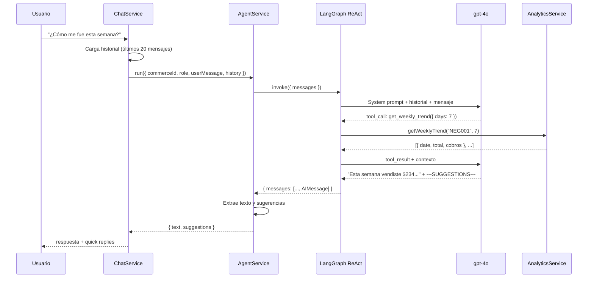
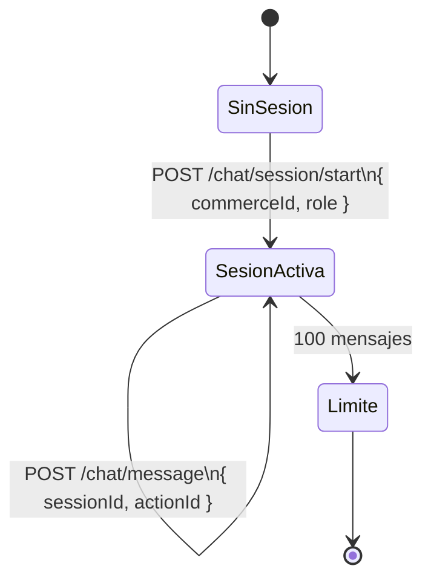

# Agente Conversacional IA — Arquitectura

## Modelo de agente

El agente usa el patrón **ReAct (Reasoning + Acting)** implementado con LangGraph. En cada turno de conversación:

1. El LLM razona sobre qué datos necesita
2. Llama a una o varias herramientas (tools)
3. Recibe los resultados
4. Genera una respuesta en lenguaje natural



---

## Las 9 herramientas del agente

Todas las herramientas tienen `commerceId` cerrado en el closure — el LLM solo recibe el schema y la descripción, nunca el ID real.

| Tool | Función analytics | Propósito |
|---|---|---|
| `get_daily_summary` | `getDailySummary()` | Ventas de un día específico |
| `get_weekly_trend` | `getWeeklyTrend()` | Tendencia diaria N días |
| `get_peak_hours` | `getPeakHours()` | Horas con más cobros |
| `get_top_clients` | `getTopClients()` | Ranking de clientes por gasto |
| `get_top_vendors` | `getTopVendors()` | Ranking de vendedores |
| `get_inactive_clients` | `getInactiveClients()` | Clientes sin visita reciente |
| `compare_weeks` | `compareWeeks()` | Esta semana vs la anterior |
| `get_best_day` | `getBestDay()` | Mejor día histórico |
| `get_general_summary` | `getGeneralSummary()` | Totales históricos |

### Ejemplo de tool definition (Zod schema)

```typescript
const getDailySummary = tool(
  async ({ date }) => JSON.stringify(analytics.getDailySummary(commerceId, date)),
  {
    name: 'get_daily_summary',
    description: 'Resumen de ventas de un día: total, cobros, ticket promedio.',
    schema: z.object({
      date: z.string().regex(/^\d{4}-\d{2}-\d{2}$/).optional()
             .describe('Fecha YYYY-MM-DD. Omitir para hoy.'),
    }),
  }
);
```

El schema Zod hace dos cosas: valida el input del LLM antes de ejecutar la query, y provee una descripción semántica que el LLM usa para elegir la herramienta correcta.

---

## System prompt

El prompt se construye por cada sesión en `agent.prompts.ts`. Se adapta al rol del usuario:

```
Eres el asistente financiero de [nombre_negocio].
Rol del usuario: ADMIN / VENDEDOR.

REGLAS DE RESPUESTA:
- Español, tuteo ("vendiste", "tus clientes")
- Dólares como "$94", nunca "94 USD"
- Sin jerga financiera (KPI, ROI, métricas)
- Máximo 3–4 oraciones a menos que pidan detalle
- No inventes datos — usa solo lo que devuelven las tools

AL FINAL DE CADA RESPUESTA incluye exactamente 3 sugerencias de preguntas
en formato: ---SUGGESTIONS--- pregunta 1 | pregunta 2 | pregunta 3
```

### Extracción de sugerencias

El agente usa un delimitador `---SUGGESTIONS---` en la respuesta del LLM para separar el texto principal de las sugerencias de seguimiento:

```typescript
const splitIdx = rawText.indexOf('---SUGGESTIONS---');
if (splitIdx !== -1) {
  const text = rawText.substring(0, splitIdx).trim();
  const suggestions = rawText
    .substring(splitIdx + '---SUGGESTIONS---'.length)
    .split('|')
    .map(s => s.trim())
    .filter(Boolean);
  return { text, suggestions };
}
```

Estas sugerencias se muestran como quick reply buttons en el frontend.

---

## Sesiones de conversación



**Ventana de contexto:** Los últimos 20 mensajes de la sesión se envían como historial al LLM. Mensajes más antiguos se truncan (no se borran de Prisma, solo se excluyen del contexto del LLM).

**Quick replies:** Cada respuesta del agente incluye sugerencias que el frontend muestra como botones. Al presionar un botón, el frontend envía `{ sessionId, actionId }` en lugar de texto. El `ChatService` resuelve el `actionId` a una pregunta en lenguaje natural antes de pasarla al agente.

```typescript
const QUICK_REPLY_MAP = {
  DAILY_SUMMARY: '¿Cómo van las ventas de hoy?',
  WEEKLY_TREND: '¿Cómo fue esta semana?',
  TOP_CLIENTS: '¿Quiénes son mis mejores clientes?',
  PEAK_HOURS: '¿A qué hora vendo más?',
  // ...
};
```

---

## Grafo LangGraph por request

El agente crea un grafo ReAct por cada request. Esto simplifica el manejo de estado — no hay estado compartido entre requests y no hay riesgo de contaminación entre sesiones. El LLM singleton es compartido.

```typescript
const agent = createReactAgent({
  llm: this.llm,          // singleton ChatOpenAI (gpt-4o)
  tools,                   // closure sobre commerceId
  stateModifier: buildSystemPrompt({ commerceId, role }),
});

const result = await agent.invoke({ messages });
```
