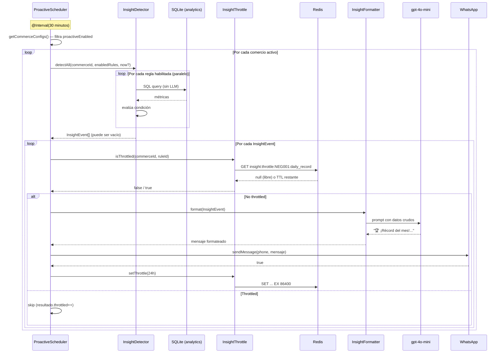

# Motor de Insights Proactivos — Arquitectura

## El principio fundamental

> El SQL detecta. El LLM solo escribe.

Este es el principio que hace el sistema económicamente escalable. Evaluar si hoy es un récord no requiere LLM — es una comparación numérica. El LLM entra únicamente cuando hay algo concreto que comunicar.

```mermaid
graph LR
    subgraph "Detección — $0 (SQL puro)"
        POLL[Polling 30min] --> DET[InsightDetector]
        DET --> R1[daily_record rule]
        DET --> R2[slow_start rule]
        DET --> R3[returning_client rule]
        DET --> R4[day_closing rule]
        R1 & R2 & R3 & R4 --> EVENTS{InsightEvent[]}
    end

    subgraph "Throttle — $0 (Redis)"
        EVENTS --> THR[InsightThrottle]
        THR --> REDIS[(Redis TTL)]
    end

    subgraph "Formateo — ~$0.001 (LLM)"
        THR -->|no throttled| FMT[InsightFormatter<br/>gpt-4o-mini]
        FMT --> MSG[Mensaje WhatsApp]
    end

    subgraph "Entrega"
        MSG --> WA[WhatsappService]
        WA --> PHONE[📱 Teléfono del dueño]
    end
```

---

## Pipeline completo



---

## Las 4 reglas implementadas

### `daily_record` — Récord del día

**Cuándo actúa:** Cuando las ventas de hoy superan cualquier día previo en la historia.  
**Ventana:** Solo antes de las 7 PM (queda tiempo para celebrar y seguir).  
**Cooldown:** 24 horas.

```typescript
// Lógica SQL de detección (sin LLM):
const today = analytics.getDailySummary(commerceId, dateStr);
const bestDay = analytics.getBestDay(commerceId);
if (today.total > bestDay.total) → dispara
```

**Ejemplo de mensaje:**
> 🏆 ¡Récord del mes! Ya llevas $187 y aún son las 3 PM. María fue tu cliente estrella hoy.

---

### `slow_start` — Mañana lenta

**Cuándo actúa:** A las 10–12 AM, si las ventas son menos del 15% del promedio diario de los últimos 14 días.  
**Cooldown:** 24 horas.

```typescript
const avgDailyTotal = historicDays.reduce(...) / historicDays.length;
if (today.total < avgDailyTotal * 0.15) → dispara
```

**Ejemplo de mensaje:**
> ☕ La mañana arrancó tranquila — solo $12 hasta las 11am. Considera activar una promoción hoy.

---

### `returning_client` — Cliente que vuelve

**Cuándo actúa:** Cuando un cliente que no había comprado en 30+ días hace una compra hoy.  
**Cooldown:** 12 horas.

```sql
-- Clients who bought today AND were absent for 30+ days before:
SELECT client_name FROM transactions t1
WHERE date = :today
  AND NOT EXISTS (
    SELECT 1 FROM transactions t2
    WHERE t2.client_id = t1.client_id
      AND t2.date < :today
      AND t2.date >= date(:today, '-30 days')
  )
  AND EXISTS (
    SELECT 1 FROM transactions t3
    WHERE t3.client_id = t1.client_id
      AND t3.date < date(:today, '-30 days')
  )
```

**Ejemplo de mensaje:**
> 👋 ¡Buena noticia! María López volvió después de más de un mes. ¡Bienvenida de vuelta!

---

### `day_closing` — Cierre del día

**Cuándo actúa:** Entre 7 PM y 9 PM, si hubo ventas en el día.  
**Cooldown:** 20 horas.

**Ejemplo de mensaje:**
> 📊 Buen día, Carmita. Cerraste con $142 en 23 cobros. Tu mejor hora fue las 12pm y Juan fue tu cliente estrella.

---

## Configuración de comercios

Los comercios se configuran en `backend/src/insights/commerce.configs.ts`. En el MVP es una constante; en producción migra a una tabla de base de datos.

```typescript
{
  commerceId: 'NEG001',
  name: 'Tienda de Carmita',
  whatsappPhone: process.env.DEMO_DESTINATION_PHONE,
  proactiveEnabled: true,
  enabledRules: ['daily_record', 'slow_start', 'returning_client', 'day_closing'],
  timezone: 'America/Guayaquil',
}
```

---

## Agregar una nueva regla

El sistema está diseñado para que agregar una regla sea mínimamente invasivo:

1. Crear `backend/src/insights/rules/mi-nueva-regla.rule.ts`:

```typescript
import { InsightRule, RuleContext } from '../types/insight-rule.interface';

export const miNuevaRegla: InsightRule = {
  id: 'mi_nueva_regla',
  name: 'Mi Nueva Regla',
  cooldownHours: 24,
  priority: 'medium',

  async detect(commerceId, ctx): Promise<InsightEvent | null> {
    // Solo SQL — sin LLM aquí
    const data = ctx.analytics.getDailySummary(commerceId, ctx.localDateStr);
    if (/* condición no cumplida */) return null;
    return {
      ruleId: 'mi_nueva_regla',
      commerceId,
      priority: 'medium',
      data: { /* datos para el formatter */ },
    };
  },
};
```

2. Agregar al array en `backend/src/insights/rules/index.ts`:

```typescript
export const INSIGHT_RULES: InsightRule[] = [
  dailyRecordRule,
  slowStartRule,
  returningClientRule,
  dayClosingRule,
  miNuevaRegla, // ← agregar aquí
];
```

3. Agregar el ID al `enabledRules` del comercio en `commerce.configs.ts`.

El orquestador (`ProactiveSchedulerService`) lo recoge automáticamente en el próximo ciclo.

---

## Testing con datos históricos

El endpoint manual acepta una fecha o datetime para simular condiciones pasadas. Cuando se pasa fecha, el throttle se salta automáticamente.

```bash
# Simula las 8pm del 10 de marzo de 2026 → dispara day_closing
curl -X POST http://localhost:3000/insights/trigger \
  -H "Content-Type: application/json" \
  -d '{"commerceId": "NEG001", "datetime": "2026-03-10T20:00:00"}'

# Simula las 11am → puede disparar slow_start y daily_record
curl -X POST http://localhost:3000/insights/trigger \
  -H "Content-Type: application/json" \
  -d '{"commerceId": "NEG001", "date": "2026-03-10"}'
```

### Reloj inyectable en reglas

Todas las reglas reciben `RuleContext.now: Date` en lugar de llamar a `new Date()` internamente. Esto permite inyectar cualquier fecha en testing:

```typescript
// En InsightDetectorService:
const ctx: RuleContext = {
  analytics: this.analytics,
  now: overrideNow ?? new Date(),
  timezone: 'America/Guayaquil',
  localDateStr: formatter.format(now), // YYYY-MM-DD en zona local
};
```

---

## Análisis de costos

```
Para 100 comercios activos:
─────────────────────────────────────────────────────
Polling cada 30min × 100 comercios = 4,800 SQL queries/día
Costo SQL: $0.00 (SQLite local)

Insights que disparan (estimado 2-3/día/comercio activo):
→ 50 comercios activos × 2.5 insights = 125 insights/día
→ gpt-4o-mini, ~150 tokens/mensaje
→ $0.0008 por insight

Costo LLM/día: ~$0.10
Costo LLM/mes: ~$3.00 para 100 comercios
Costo por comercio/mes: ~$0.03
─────────────────────────────────────────────────────
```

La escalabilidad viene de que el 99.9% de los ciclos de polling no llaman al LLM.

---

## Camino a producción

| Componente MVP | Reemplazo en producción |
|---|---|
| `whatsapp-web.js` (Puppeteer) | WhatsApp Business API (Meta/Twilio) |
| SQLite polling | Postgres `NOTIFY`/`LISTEN` — triggers en cada transacción |
| `commerce.configs.ts` (hardcoded) | Tabla `commerce_configs` en Postgres |
| Redis local | Redis cluster / Elasticache |
| `gpt-4o-mini` | Mismo modelo; escala linealmente |
