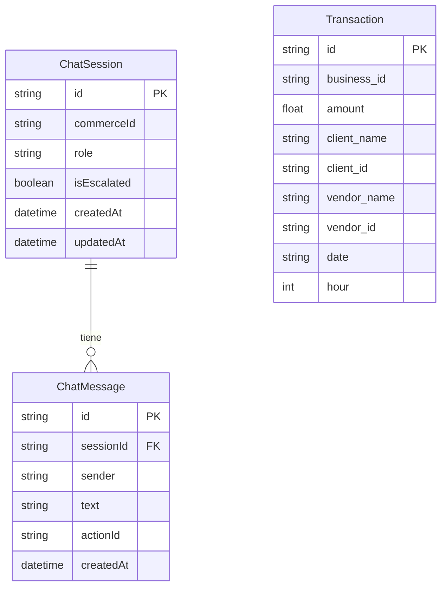
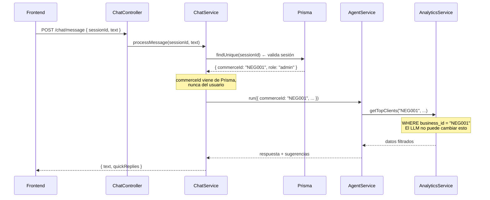

# Arquitectura del sistema — Cuentitas

## Visión general

Cuentitas es un monorepo con dos proyectos npm independientes: un frontend React y un backend NestJS. Los dos se comunican por HTTP REST.

```mermaid
graph TB
    subgraph "Frontend — React 19 / Vite (port 5173)"
        APP[App.tsx<br/>Login + Dashboard]
        CHAT[ChatbotView.tsx<br/>Interfaz conversacional]
        DASH[MisCuentitas.tsx<br/>Dashboard de tarjetas]
    end

    subgraph "Backend — NestJS 11 (port 3000)"
        direction TB
        subgraph "ChatModule"
            CC[ChatController<br/>POST /chat/*]
            CS[ChatService<br/>Sesiones + mensajes]
            AS[AgentService<br/>LangGraph ReAct]
        end

        subgraph "InsightsModule"
            DET[InsightDetectorService<br/>SQL puro — sin LLM]
            THR[InsightThrottleService<br/>Redis TTL]
            FMT[InsightFormatterService<br/>gpt-4o-mini]
            SCH[ProactiveSchedulerService<br/>@Interval 30min]
            WA[DeliveryRouterService]
        end

        subgraph "AnalyticsModule"
            ANALY[AnalyticsService<br/>9 queries tipados]
        end

        subgraph "Infraestructura"
            DB[DbService<br/>better-sqlite3]
            PRIS[PrismaService<br/>ORM sesiones]
            REDIS[RedisService<br/>ioredis lazy]
            WAS[WhatsappService<br/>whatsapp-web.js]
        end
    end

    subgraph "Datos"
        SQLITE[(cuentitas.db<br/>Analytics — solo lectura<br/>12 meses / 3 negocios)]
        SESSDB[(dev.db<br/>Sesiones de chat<br/>Prisma ORM)]
        REDISDB[(Redis<br/>Throttle de insights)]
        WAPP[📱 WhatsApp<br/>Mensajería proactiva]
    end

    APP --> CC
    CHAT --> CC
    DASH --> ANALY

    CC --> CS
    CS --> AS
    AS --> ANALY
    ANALY --> DB
    DB --> SQLITE
    CS --> PRIS
    PRIS --> SESSDB

    SCH --> DET
    DET --> ANALY
    SCH --> THR
    THR --> REDIS
    REDIS --> REDISDB
    SCH --> FMT
    SCH --> WA
    WA --> WAS
    WAS --> WAPP
```

---

## Módulos del backend

### AppModule (raíz)
Importa todos los feature modules. Ningún provider de negocio vive aquí.

```
AppModule
├── PrismaModule   (@Global) — ChatSession, ChatMessage
├── DbModule       (@Global) — SQLite analytics (better-sqlite3)
├── RedisModule    (@Global) — ioredis, lazy connect
├── ChatModule              — Conversación IA
├── WhatsappModule          — Cliente Puppeteer
└── InsightsModule          — Motor de insights proactivos
```

### ChatModule
Responsabilidad: sesiones de conversación y orquestación del agente.

| Componente | Rol |
|---|---|
| `ChatController` | Endpoints REST (`/chat/session/start`, `/chat/message`) |
| `ChatService` | Ciclo de vida de sesión, historial (Prisma), límites |
| `AgentService` | LangGraph ReAct loop, 9 tools, extrae sugerencias |
| `agent.prompts.ts` | Construye el system prompt según rol (admin / vendedor) |

### InsightsModule
Responsabilidad: detección proactiva de eventos y envío por WhatsApp.

| Componente | Rol |
|---|---|
| `ProactiveSchedulerService` | Orquestador — `@Interval(30min)` |
| `InsightDetectorService` | Evalúa reglas en paralelo, sin LLM |
| `InsightThrottleService` | Redis TTL por `(commerceId, ruleId)` |
| `InsightFormatterService` | `gpt-4o-mini` convierte datos en mensaje WhatsApp |
| `DeliveryRouterService` | Enruta el mensaje al canal correcto |

### AnalyticsModule
Responsabilidad: capa de acceso a datos. No expone endpoints HTTP propios.

Todas las queries reciben `commerceId` como primer parámetro — el LLM nunca puede omitirlo ni sobreescribirlo. Queries siempre parametrizadas (no SQL dinámico).

---

## Bases de datos

El sistema usa dos bases de datos SQLite con propósitos completamente distintos:



| Base de datos | Archivo | Acceso | ORM |
|---|---|---|---|
| Sesiones de chat | `backend/dev.db` | Lectura/escritura | Prisma |
| Analytics (transacciones) | `data/cuentitas.db` | Solo lectura | better-sqlite3 |

---

## Seguridad y aislamiento de datos



Principios de seguridad:
- `commerceId` **nunca** viene del body del usuario — siempre de la sesión Prisma
- Tools del agente tienen `commerceId` en closure — el LLM no puede sobreescribirlo
- Queries SQL son **siempre parametrizadas** — sin interpolación de strings
- `MAX_MESSAGES_PER_SESSION = 100` — límite de rate por sesión

---

## Decisiones de arquitectura

### ¿Por qué SQLite y no Postgres?

Para el hackathon, SQLite permite incluir los datos directamente en el repositorio (`data/cuentitas.db`) sin necesidad de servidor externo. En producción, `AnalyticsService` y `DbService` se reemplazarían por un driver Postgres sin cambios en la lógica de negocio.

### ¿Por qué dos bases de datos separadas?

| Necesidad | Solución |
|---|---|
| Datos de transacciones (solo lectura, grandes volúmenes) | `better-sqlite3` directo — más rápido para queries analíticos |
| Sesiones de chat (lectura/escritura, relacional) | Prisma ORM — migraciones tipadas, relaciones |

Mezclarlos complicaría el esquema y acoplaría el analytics al ORM.

### ¿Por qué `@Interval` y no webhooks de Deuna?

En producción, cada transacción de Deuna dispararía un evento que el motor evaluaría en tiempo real. Para el hackathon, el polling cada 30 minutos es suficiente y no requiere integración con sistemas externos. La separación detección/formateo hace que el cambio sea trivial.

### ¿Por qué plain objects para las reglas y no clases con DI?

Las reglas de insights son funciones puras: reciben `(commerceId, ctx)` y devuelven `InsightEvent | null`. No necesitan inyección de dependencias porque reciben el `AnalyticsService` a través del `RuleContext`. Esto las hace fáciles de testear de forma unitaria sin el contenedor de NestJS.
